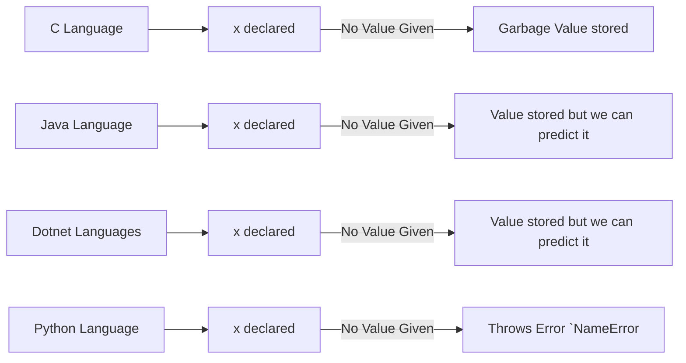
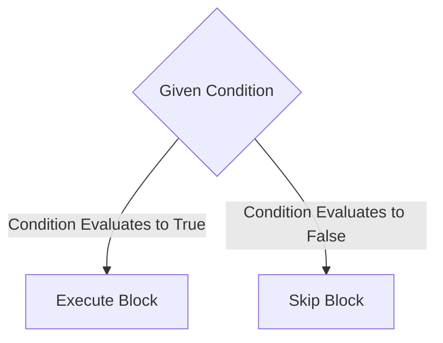
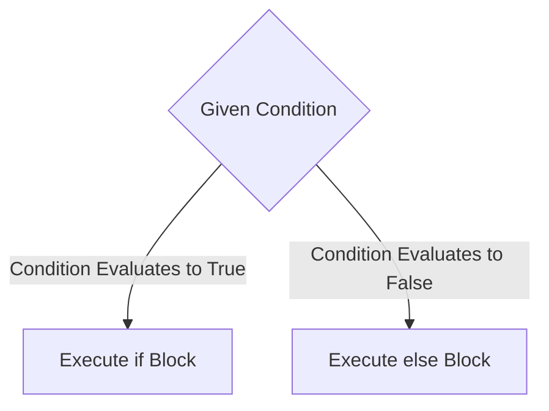
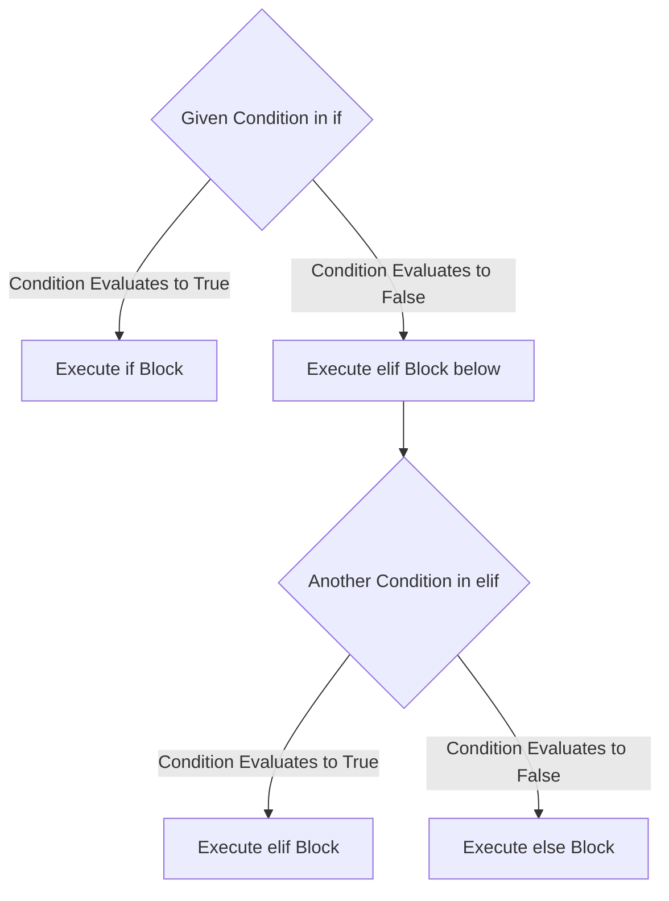

> [!TIP]
> This Page supports running Python directly from your browser! If the Run Button doesn't show the run or loading button, try reloading your browser.

::: details  Click for more details. If this feature is not working as expected, [please report it to us on Github!](https://github.com/sounddrill31/course-notes-python/issues/new)

> [!WARNING]
> This will not work if your browser is too old or does not support Web Assembly/Web Workers. If you're using a privacy focused browser like cromite, please enable JavaScript JIT and WebAssembly from the permissions menu.
:::

## Features of Python and Info
- Simple, Easy to Learn
  - Implementing critical business requirements through less lines of code
- Initially implemented by Guido Van Rossum in 1989, released in 1991 using Assembly
  - Formed into Python Software Foundation, reimplented in C (CPython)
- [OSS, ***Python Software Foundation License Version 2***](https://docs.python.org/3/license.html)
  - > Python software and documentation are licensed under the Python Software Foundation License Version 2.
    > Starting with Python 3.8.6, examples, recipes, and other code in the documentation are dual licensed under the PSF License Version 2 and the Zero-Clause BSD license.
- Python is a case-sensitive programming language
- Dynamically typed, will be explored in [Datatypes](#data-types) section

## PEP8 Validation
Using `pylint`, we can easily validate our code and find errors in it. It is a tool that checks our code for errors and provides suggestions for improvements based on PEP8 standards and more, mainly rating conformity
- [PEP8: Python Enhancement Proposal 8](https://peps.python.org/pep-0008/)
  - Document/Manual that contains suggestions for coding standards and best practices


### Install PyLint
0. Make a Virtual Environment, to comply with [PEP 668](https://peps.python.org/pep-0668/) and not mess up our system python packages. Remember to enter it afterwards before performing any operations. (Not required on windows, but greatly recommended)
```bash
python3 -m venv myenv # optional, makes a virtual environment in myenv directory
```
Enter the virtual environment
```
source myenv/bin/activate
```
1. Install PyLint
```bash
pip install pylint
```
2. Verify PyLint is installed and works
```bash
  pylint --version
```

### Rate Code based on PEP8 using PyLint
```bash
pylint main.py # replace main.py with your python file name
```

## Example Program
```python
x=100
y=20
print(x)
print(y)
print(x+y)
print(x-y)
print(x*y)
print(x/y)
```
::: details Try it out
```python:line-numbers
x=100
y=20
print(x)
print(y)
print(x+y)
print(x-y)
print(x*y)
print(x/y)
```
<Editor id="head-example-prg1-addsub" />
:::


Output:
```
100
20
120
80
2000
5.0
```

### Verify through PyLint
```bash
pylint main.py
```

Output:

```
************* Module main
main.py:1:0: C0114: Missing module docstring (missing-module-docstring)
main.py:1:0: C0103: Constant name "x" doesn't conform to UPPER_CASE naming style (invalid-name)
main.py:2:0: C0103: Constant name "y" doesn't conform to UPPER_CASE naming style (invalid-name)

------------------------------------------------------------------
Your code has been rated at 6.25/10 (previous run: 8.18/10, -1.93)
```

Fixed Code:

```python
"""Simple Program to demonstrate Arithmetic Operations""" # [!code ++]

x = 100 # [!code --]
X = 100 # [!code ++]
y = 20 # [!code --]
Y = 20 # [!code ++]
print(x) # [!code --]
print(X) # [!code ++]
print(y) # [!code --]
print(Y) # [!code ++]
print(x + y) # [!code --]
print(X + Y) # [!code ++]
print(x - y) # [!code --]
print(X - Y) # [!code ++]
print(x * y) # [!code --]
print(X * Y) # [!code ++]
print(x / y) # [!code --]
print(X / Y) # [!code ++]
```

```
-------------------------------------------------------------------
Your code has been rated at 10.00/10 (previous run: 6.25/10, +3.75)
```

> [!TIP]
> in Diff View, Red Indicates that the code was removed and Green indicates that the code was added.

## Data Representation

Any Business Organization usecase or scenario contains 2 parts:

- Data
- Operations

Eg. Bank

- CUST
  - data
    - cname, cadd, cacno, cbal, etc
  - operations
    - credit(), debit(), balenq(), transfer(), etc
- EMP
  - data
    - ename, eadd, eid, ebasicsal, etc
  - operations
    - da(), hra(), pf(), tsal(), etc

We represent:

- data with:
  - data types
  - data structures
- operations with:
  - methods
  - functions
  - (or both)

## Data Types

### Introduction

Datatypes are some keywords of programming languages that are used to specify how much memory will be allocated to the variables during execution

- Also decides the type of data to be stored in the memory location of the variables
- Without defining datatypes to variables, either explicitly or internally, memory will not be allocated to the variables

### Static vs Dynamic Languages

Types of Languages using Datatypes:

- Static Typed Programming Languages
  - Datatypes of variables are fixed
  - Programmer should declare the datatypes to the variables explicitly at the time of writing the program
  - In C, C++, Java, dotnet, etc, we need to declare the datatype of the variables
- Dynamically Typed Programming Languages
  - The Datatypes of the variables are declared internally based on given data
  - If new variable doesn't match the old datatype, it is redeclared so it will not cause errors
  - In python, we mustn't declare the datatype explicitly
    ```python
    abc = 1000
    print(f"{abc} and type is {type(abc)}")
    abc = "souhrud"
    print(f"{abc} and type is {type(abc)}")
    ```
    - Output:
      ```
      1000 and type is <class 'int'>
      souhrud and type is <class 'str'>
      ```
::: details Try it out
```python:line-numbers
abc = 1000
print(abc)
print(type(abc))
abc = "souhrud"
print(abc)
print(type(abc))
```
<Editor id="Types-eg1-string-int-diff" />
:::
### Standard Library Datatypes
Python internally uses the following Standard Datatypes
- int
- float
- NoneType
- complex
- bool
- str
- range
- list
- tuple
- frozenset
- dict
- bytes
- bytearray
- memoryview

### Types Demo

In python, datatypes of variables are declared internally at the time of execution of the program based on data assigned to variables

- Example:
  ```python
  i = 1000
  print(i)
  print(type(i))
  j = 123.123
  print(J)
  print(type(j))
  k=True
  print(k)
  print(type(k))
  p="souhrud"
  print(p)
  print(type(p))
  ```
- Output:
  ```
  1000
  <class 'int'>
  123.123
  <class 'float'>
  True
  <class 'bool'>
  souhrud
  <class 'str'>
  ```

::: details Try it out

```python:line-numbers
i = 1000
print(i)
print(type(i))
j = 123.123
print(j)
print(type(j))
k=True
print(k)
print(type(k))
p="souhrud"
print(p)
print(type(p))
```

<Editor id="type-example2-moretypes" />
:::

### Types of Datatypes

Programming languages support 2 types of datatypes:

1. Primitive types
2. Reference types

- Primitive Datatypes
  - contains fixed size
  - Languages that support these are not regarded as complete object-oriented-programming languages, like Java and dotnet.
- Reference Datatypes

  - doesn't contain fixed size
  - Python is a programming language that only supports reference type datatypes.

    - Every datatype is implemented through `class` syntax in Python
    - `class` syntax follows dynamic memory allocation so that there is no fixed size for datatypes in Python
    - Memory space allocated for `class` syntax is technically known as an object

      - Memory allocation for class is called object creation.
      - Memory deallocation is called object deletion.
      - Any number of objects can be created for a class

      <!-- Diagram with a box `class int:` and x=1000 where is a circle with 1000 inside and pointing to the x=1000 using a line TODO: Write in mermaid -->


### Boxing and Unboxing

Java and dotnet allows you to convert every Primitive to Reference Datatypes(called boxing, using wrapper classes). The process of converting Reference Datatypes to Primitive type is called unboxing.

  <!--id  function to know address and getsizeof thru sys -->

We use the `id()` function to know the address of an object and `getsizeof()`(from the `sys` module) to know the size of an object.

- Because we're using `sys` module,we have to import it before we use it. Syntax: `import sys`

<!-- Builtin functions: Link official docs-->

### Example

```python
import sys
x=1000
print(x)
print(type(x))
print(sys.getsizeof(x))
y=12345678901234567890
print(y)
print(type(y))
print(id(y))
print(sys.getsizeof(y))
```

Output:

```
1000
<class 'int'>
28
12345678901234567890
<class 'int'>
140442143993136
36
```

::: details Try it out

```python:line-numbers
import sys
x=1000
print(x)
print(type(x))
print(sys.getsizeof(x))
y=12345678901234567890
print(y)
print(type(y))
print(id(y))
print(sys.getsizeof(y))
```

<Editor id="example-id-typeof-eg3" />

The object size here might be smaller than the previous output thanks to Pyodide optimizations
:::

> [!TIP]
> The IDs change every time you run it since they are the memory addresses holding the value of x and y

Overwriting a variable automatically dereferences old objects, and the garbage collector drops it when reference count becomes 0

<!-- x=1000 # now unused, will be dereferenced and dropped by garbage collector when  Reference count becomes 0
x=2000-->


example:

```python
import sys
x=1000
print(x)
print(type(x))
print(id(x))
print(sys.getsizeof(x))
x=12345678901234567890
print(x)
print(type(x))
print(id(x))
print(sys.getsizeof(x))
x=123.456
print(x)
print(type(x))
print(id(x))
print(sys.getsizeof(x))
```

Output:

```
1000
<class 'int'>
140442144833040
28
12345678901234567890
<class 'int'>
140442143994720
36
123.456
<class 'float'>
140442144832880
24
```

::: details Try it out

```python:line-numbers
import sys
x=1000
print(x)
print(type(x))
print(id(x))
print(sys.getsizeof(x))
x=12345678901234567890
print(x)
print(type(x))
print(id(x))
print(sys.getsizeof(x))
x=123.456
print(x)
print(type(x))
print(id(x))
print(sys.getsizeof(x))
```

<Editor id="examle-prg4-getsizeof" />
The object size here might be smaller than the previous output thanks to Pyodide optimizations
:::

## Categories of Data Types
Python Datatypes are categorized into different categories.

### 1. Numerical Types

- Used to represent the non-decimal point numerical values, decimal point numerical values and complex values
- Python supports 3 Numerical Types:
  1. `int`
  2. `float`
  3. `complex`
- Example:
  ```python
  import sys
  x=1000
  print(x)
  print(type(x))
  print(id(x))
  print(sys.getsizeof(x))
  y=123.456
  print(y)
  print(type(y))
  print(id(y))
  print(sys.getsizeof(y))
  z=3+4j
  print(z)
  print(type(z))
  print(id(z))
  print(sys.getsizeof(z))
  ```
- Output:
  ```
  1000
  <class 'int'>
  140442144832816
  28
  123.456
  <class 'float'>
  140442201642096
  24
  (3+4j)
  <class 'complex'>
  140442144832752
  32
  ```
  ::: details Try it out
  ```python:line-numbers
  import sys
  x=1000
  print(x)
  print(type(x))
  print(id(x))
  print(sys.getsizeof(x))
  y=123.456
  print(y)
  print(type(y))
  print(id(y))
  print(sys.getsizeof(y))
  z=3+4j
  print(z)
  print(type(z))
  print(id(z))
  print(sys.getsizeof(z))
  ```
  <Editor id="example-prg5-numeric-demos" />
  The object size here might be smaller than the previous output thanks to Pyodide optimizations
  :::

### 2. Boolean types

- Boolean category Datatypes represent a Boolean value, `True` or `False`
- Python supports only one Boolean category datatype, `bool`
- Example:
  ```python
  import sys
  x=True
  print(x)
  print(type(x))
  print(id(x))
  print(sys.getsizeof(x))
  ```
- Output
  ```
  True
  <class 'bool'>
  140442258316512
  28
  ```
  ::: details Try it out
  ```python:line-numbers
  import sys
  x=True
  print(x)
  print(type(x))
  print(id(x))
  print(sys.getsizeof(x))
  ```
  <Editor id="example-prg6-booleandemos" />
  The object size here might be smaller than the previous output thanks to Pyodide optimizations
  :::

### 3. NoneType
<!-- TODO: Add Class 8 contents -->
`NoneType` is used to represent a `None` value
- Python supports only one `NoneType` datatype, `NoneType` (class)



    A[Java Language(s)] --> B2[x declared] --No Value Given--> C2[Value stored but we can predict it]
    A[Dotnet Languages] --> B3[x declared] --No Value Given--> C3[Value stored but we can predict it]
    A[Python Language] --> B4[x declared] --No Value Given--> C4[Throws Error `NameError`]
    ```

Here, we want to use `x` but we don't need it yet/don't have clarity on what to do with it

```python
x
print(x)
```

> [!ERROR]
> NameError: name 'x' is not defined

So we assign a `NoneType` class value `None` to object `x`

```python
x=None
print(x)
print(type(x))
```

Output:

```
None
<class 'NoneType'>
```

### 4. str

### Mutable Objects vs Immutable Objects

Mutable Objects are those objects whose value can be changed after creation.
Mutable Objects are:

- `List`
- `Dictionary`
- `Set`
- User Defined Classes

Immutable Objects are those objects whose value cannot be changed after creation. If they are changed, they are redeclared and recreated.
Immutable Objects are:

- `int`
- `float`
- `bool`
- `str`
- `tuple`
- `frozenset`

<!-- Mutable Vs Immutable Objects -->
<!-- Operators and magic methods -->
<!-- TODO: Add contents upto Class 10-->

## Operators

### Magic Methods

TODO

Python Operators are categorized into different categories:

### Arithmetic Operators

- Used to perform mathematical arithmetic operations like Addition, Subtraction, Multiplication,Division, Modulus, Floor Division and Exponentiation Operations

```python
  x=14
  y=3
  print(x+y) # Addition
  print(x-y) # Subtraction
  print(x*y) # Multiplication
  print(x/y) # Division
  print(x%y) # Modulus
  print(x//y) # Floor Division
  print(x**y) # Exponent/Power (x^y)
```

- Output:

```
17
11
42
4.666666666666667
2
4
2744
```

::: details String Multiplication

```python
x="souhrud"
y=3
print(x*y) # int * string is supported
```

Output:

```
souhrudsouhrudsouhrud
```

:::

### Comparison Operators

- Data Comparison
  - Comparison Operators are used to compare the data of the objects, pointed by the operands
  ```python
  x="100"
  y="20"
  print(x>y)
  print(x>=y)
  print(x<y)
  print(x<=y)
  print(x==y) # = is for assignment, == is for comparison
  print(x!=y)
  ```
  - Output:
  ```
  False
  False
  True
  True
  False
  True
  ```
  <!-- mermaid diagram april 21 8:05, a=1000 object, b=2000  -->

### Identity Operators

- Address Comparison
  - Identity Operators are used to compare the id of the objects, pointed by the operands
  - We cannot rely on it to behave like Comparison Operators
  - Python supports two Identity Operators:
    - `is`
    - `is not`

#### Eg 1: In this context, it behaves the same as comparison operations

```python
x=1000
print(x)
print(id(x))
y=2000
print(y)
print(id(y))
print(x is y)
print(x is not y)
```

Output:

```
1000
140611664345872
2000
140611664346544
False
True
```

#### Eg 2: When values are the same and the id is the same, it is `True`

```python
x=2000
print(x)
print(id(x))
y=x
print(y)
print(id(y))
print(x is y)
print(x is not y)
```

Output:

```
3000
140611664346800
3000
140611664346800
True
False
```

#### Eg 3. With lists

```python
x=[10,20,30]
print(x)
print(id(x))
y=[40,50,60]
print(y)
print(id(y))
print(x==y)
print(x!=y)
print(x is y)
print(x is not y)
```

Output:

```
[10, 20, 30]
140611663549632
[40, 50, 60]
140611663544960
False
True
False
True
```

#### Eg4. List with same values

```python
x=[70,80,90]
print(x)
print(id(x))
y=[70,80,90]
print(y)
print(id(y))
print(x==y)
print(x!=y)
print(x is y)
print(x is not y)
```

Output:

```
[70, 80, 90]
140611663527104
[70, 80, 90]
140611745457536
True
False
False
True
```

List is immutable, duplicate objects are created

### Membership Operators

Membership Operators are used to search whether a particular element is available or not in a given Iterable type Objects

- Non-Iterable Objects
  - Any object that can only store one value is called a Non-Iterable Object
  - int, float, bool, NoneType, etc
- Iterable Objects
  - Any object that can store 0 or more values is called an Iterable Object
  - str, list, tuple, etc

> [!TIP]
> Membership operators only work on Iterable Objects

Python supports 2 Membership Operators:

- `in`
- `not in`

Eg.

```python
x = [70, 80, 90]
print(60 in x)
print(60 not in x)
print(80 in x)
print(80 not in x)
```

Output:

```
False
True
True
False
```

Eg2.

```python
x=789
print(x)
print(8 in x)
print(8 not in x)
print(6 in x)
print(6 not in x)
```

> [!ERROR]
> TypeError: argument of type 'int' is not iterable

Eg3.

```python
x="789"
print(x)
print('8' in x)
print('8' not in x)
print('6' in x)
print('6' not in x)
```

Output:

```
789
True
False
False
True
```

### Bitwise Operators

Bitwise Operators are used to perform bitwise operations on integers.

Python supports 6 Bitwise Operators:

- `&` (Bitwise AND)
- `|` (Bitwise OR)
- `^` (Bitwise XOR)
- `~` (Bitwise NOT) <!-- Get this cleared -->
- `<<` (Bitwise Left Shift)
- `>>` (Bitwise Right Shift)

Eg. <!-- 128 64 32 16 8 4 2 1 -->

```python
x = 10 # 0 0 0 0 1 0 1 0
y = 6  # 0 0 0 0 0 1 1 0
print(x & y) # Boolean AND, 0 0 0 0 0 0 1 0 = 2
print(x | y) # Boolean OR,  0 0 0 0 1 1 1 0 = 14
print(x ^ y) # Boolean XOR, 0 0 0 0 1 1 0 0 = 12
print(~x) # Boolean NOT, 1 1 1 1 0 1 0 1 = Negative 11
print(x << 2) # Boolean Left Shift by 2 Positions, 0 0 1 0 1 0 0 0 = 32 + 8 = 40
print(x >> 2) # Boolean Right Shift by 2 Positions,0 0 0 0 0 0 1 0 = 2
```

Output:

```
2
14
12
-11
40
2
```

### Unary Operators

The Operators which we can apply on only one operand are called Unary Operators

- `+` (Unary Plus)
- `-` (Unary Minus)
- `~` (Unary NOT), already covered under Unary Operators

Eg.

```python
x=10
print(+x)
print(-x)
```

Output:

```
10
-10
```

### Logical Operators

Logical Operators are used to perform mathematical logical operations on Boolean values.

Python supports 3 Logical Operators:

- `and` (Logical AND)
- `or` (Logical OR)
- `not` (Logical NOT)

Eg.

```python
x = True
y = False
print(x)
print(y)
print(x and y) # Logical AND
print(x or y) # Logical OR
print(not x) # Logical NOT
```

Output:

```
True
False
False
True
False
```

## Operator Precedence

Expressions are evaluated from Highest to Lowest Precedence, and in the given directionif they have the same Precedence.
| Operator | Direction | Precedence | Meaning |
|----------------------------------|---------------|-------------|-----------------------------------------|
| `(`, `)` | Left to Right | Highest | Brackets |
| `**` | Right to Left | High | Exponent |
| `+x`, `-x`, `~` | Right to Left | High | Unary Plus, Minus, Bitwise NOT |
| `*`,`/`,`//`,`%` | Left to Right | Medium-high | Multiplication, Division, Floor Division, Modulus |
| `+`, `-` | Left to Right | Medium | Addition, Subtraction |
| `<<`, `>>` | Left to Right | Medium | Bitwise Left Shift, Bitwise Right Shift |
| `&` | Left to Right | Medium-low | Bitwise AND |
| `^` | Left to Right | Medium-low | Bitwise XOR |
| `\|` | Left to Right | Medium-low | Bitwise OR |
| `==`, `!=`, `<`, `>`, `<=`, `>=` | Left to Right | Low | Comparison Operators |
| `is`, `is not`, `in`, `not in` | Left to Right | Low | Identity and Membership Operators |
| `not` | Right to Left | Low | Logical NOT |
| `and` | Left to Right | Low | Logical AND |
| `or` | Left to Right | Lowest | Logical OR |

```python
x=10
print(x)
y=20
print(y)
z=30
print(z)
p=x+y*z # 10 + (20 * 30)
print(p)
q=x-y+z # 10 - 20 + 30
print(q)
r=x*y+z # (10 * 20) + 30
print(r)
s=x+y*x/y+z # 10 + (20 * 10 / 20) + 30
print(s)
```

Output:

```
10
20
30
610
20
230
50.0
```

## Blocks

A set of statements following the same indentation is known collectively as a block.

- Block begins when Indentation increases
- Block ends when Indentation decreases to the containing block's Indentation or no Indentation
- Block should contain atleast one statement
- A Block can contain another block
- For Indentation, atleast one space is required but we generally use tab space or 4 spaces

| Other Languages                                                  | Python                                                |
| ---------------------------------------------------------------- | ----------------------------------------------------- |
| Other Languages use curly brackets to group statements together. | Python uses indentation to group statements together. |

```
{ stm_1
...
stm_n
}
```

```
stm1 # Block 0
stm2 # Block 0
  stm3 # Block 1
  stm4 # Block 1
    stm5 # Block 2
    stm6 # Block 2
  stm7 # Block 1
  stm8 # Block 1
stm9 # Block 0
stm10 # Block 0
```

TODO: Fix

## Flow Control Statements

Control flow Statements or flow control statements are used to change the normal flow of execution of a program.
Python supports two types of flow control statements:

- Conditional Statements
- Loop Statements

### Normal Flow of Execution

| Other Languages             | Python                                            |
| --------------------------- | ------------------------------------------------- |
| Execute main function first | Execute statements from top to bottom of the file |

## Conditional Statements

Conditional Statements are used to decide whether the block has to be executed or to skip execution of the block based on the given condition

### Condition

Any expression that evaluates to a Boolean value is known as a condition.

- Every Condition is an expression but not all expressions are conditions

```python
a=10
b=20
a+b # Not a condtion
a>b # Condition, will return False
```

1. if
2. else
3. elif

### `if` Statements



Syntax:

```
if condition:
    statement_1
    statement_2
    ...
    statement_n
```

Example:

```python
print("begin")
x = int(input("enter number:    "))
if x % 2 == 0:
    print("even")
print("end")
```

Output:

```
> python3 if-conditional.py
begin
enter number:    50
even
end
```

### `else` Statements
> [!TIP]
> `else` should always have a preceeding `if`, `elif`, `while` or `for` block. `else` doesn't have a condition, it works based on its preceeding block.
Whenever `else` block's preceeding block evaluates to `False`, then the `else` block is executed.


Syntax:

```
if condition:
    statement_1
    statement_2
    ...
    statement_n
else:
    statement_1
    statement_2
    ...
    statement_n
```

Example:

```python
print("begin")
x = int(input("enter number:    "))
if x % 2 == 0:
    print(x," is an even number")
else:
    print(x," is an odd number")
print("end")
```

Output:

```
> python3 if-conditional.py
begin
enter number:    50
50 is an even number
end
> python3 conditional.py
begin
enter number:    3
3 is an odd number
end
```

### `elif` Statements

> [!TIP] > `elif` should always have a preceeding `if`, or another `elif` block.
> Whenever `elif` block's preceeding block evaluates to `False`, then the `elif` block is executed.

- After Control reaches `elif` block,
  - if condition evaluates to true, then execute `elif` block
  - if condition evaluates to false, then execute `else` block



Syntax:

```
if condition:
  statement_1
  ...
  statement_n
elif condition2:
  statement_1
  ...
  statement_n
else:
  statement_1
  ...
  statement_n
```

Example:
```python
s1=float(input("Enter subject 1 marks: "))
s2=float(input("Enter subject 2 marks: "))
s3=float(input("Enter subject 3 marks: "))
s4=float(input("Enter subject 4 marks: "))

avg=(s1+s2+s3+s4)/4

if avg>90:
    print("Grade A")
elif avg>70:
    print("Grade B")
elif avg>50:
    print("Grade C")
else:
    print("Failed!")
```
Output:
```
> python3 elif-prg.py
Enter subject 1 marks: 50
Enter subject 2 marks: 90
Enter subject 3 marks: 7
Enter subject 4 marks: 86
Grade C
> python3 elif-prg.py
Enter subject 1 marks: 100
Enter subject 2 marks: 60
Enter subject 3 marks: 40
Enter subject 4 marks: 90
Grade B
```

### Example Programs

1. Palindrome Checker

```python
x = input("enter String:    ")
print("Entered number is:", x)
rev_x = x[::-1] # Quickly reverse using slice operator, by providing step as -1
if x == rev_x:
    print(x,"is a Palindrome")
else:
    print(x, "is not a Palindrome")
```

Output:

```
> python3 palindrome.py
enter String:    xyzzyx
Entered number is: xyzzyx
xyzzyx is a Palindrome
> python3 palindrome.py
enter String:    hello
Entered number is: hello
hello is not a Palindrome
```


## Looping Statements
Are used to execute a block of code repeatedly until a certain condition is met

<!--
### for
#### for else
### while
#### while else
-->
